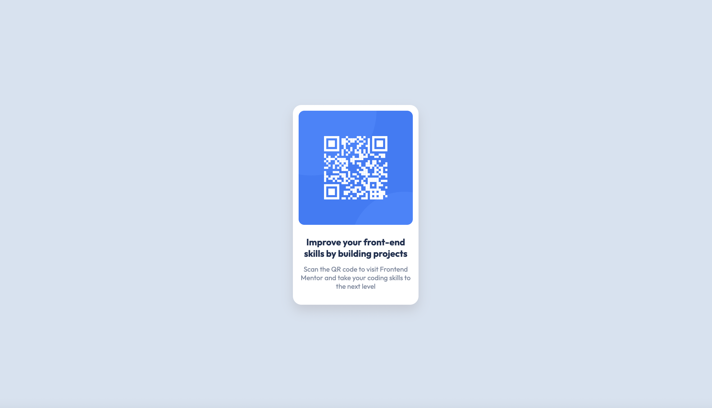

# QR code component solution

## Table of contents

- [Overview](#overview)
  - [Screenshot](#screenshot)
  - [Links](#links)
- [My process](#my-process)
  - [Built with](#built-with)
- [Author](#author)

## Overview

### Screenshot
### My Solution

### Links

- Solution URL: [Here is the solution on Github](https://github.com/ciesluk/QR-Code-Component)
- Live Site URL: [Click here to view it live](https://62e5bf24a8681668fc120b17--steady-kitten-53dbcb.netlify.app/)

## My process

### Built with

- HTML5 Markup
- CSS3
- Flexbox

## Author

- Website - [Tom Cieslukowski](https://www.tomcieslukowski.com)
- Frontend Mentor - [@ciesluk](https://www.frontendmentor.io/profile/ciesluk)
- Instagram - [@ciesluk_codes](https://www.instagram.com/ciesluk_codes/)
